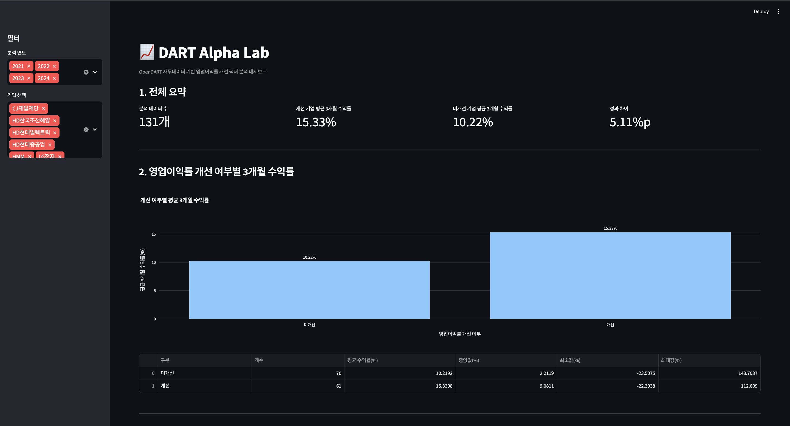

# DART Alpha Lab: OpenDART 기반 재무 팩터 퀀트 리서치

## 1. 프로젝트 소개

**DART Alpha Lab**은 OpenDART 재무제표 데이터를 활용하여 한국 상장기업의 재무 팩터와 이후 주가 수익률의 관계를 분석하는 퀀트 리서치 프로젝트입니다.

현재 버전에서는 **비금융 대형주를 대상으로, 영업이익률이 전년 대비 개선된 기업이 이후 3개월 동안 더 높은 수익률을 보였는가**를 분석합니다.

이 프로젝트는 단순히 주가를 예측하는 모델이 아니라, 실제 공시 재무데이터를 수집하고, 재무 팩터를 계산한 뒤, 공시 이후 주가 수익률과 연결하여 투자 아이디어를 검증하는 데이터 분석 파이프라인을 구현하는 데 목적이 있습니다.

---

## 2. 핵심 아이디어

본 프로젝트의 핵심 질문은 다음과 같습니다.

> 전년 대비 영업이익률이 개선된 기업은 이후 3개월 주가 수익률이 더 좋았을까?

이를 검증하기 위해 다음 과정을 거칩니다.

```text
OpenDART 기업코드 수집
→ 분석 대상 비금융 대형주 선정
→ 기업별 재무제표 수집
→ 매출액, 영업이익 추출
→ 영업이익률 계산
→ 전년 대비 영업이익률 개선 여부 판단
→ 실제 사업보고서 공시일 수집
→ 공시일 이후 첫 거래일 기준으로 진입일 설정
→ 주가 데이터 수집
→ 3개월 미래 수익률 계산
→ Streamlit 대시보드 시각화
```

---

## 3. 대시보드 미리보기

아래 이미지는 Streamlit 대시보드 예시입니다.

> 스크린샷 파일을 `assets/dashboard_summary.png` 경로에 넣으면 아래에 자동으로 표시됩니다.



---

## 4. 주요 기능

### 4.1 OpenDART 기업코드 수집

OpenDART API를 사용하여 한국 상장기업의 기업 고유번호, 종목코드, 기업명을 수집합니다.

수집 항목 예시:

- 기업 고유번호
- 종목코드
- 기업명
- 최종 변경일

---

### 4.2 분석 대상 기업 선정

현재 버전에서는 일반 제조업, IT, 플랫폼, 화학, 2차전지, 통신, 바이오 등 **비금융 대형주 중심**으로 분석 대상을 구성했습니다.

금융업은 일반 기업과 재무제표 구조가 크게 다르기 때문에 현재 영업이익률 팩터 분석에서는 제외했습니다.

제외한 금융업 예시:

- 은행
- 금융지주
- 보험
- 증권

금융업은 향후 ROE, 순이익 성장률, 자본적정성 등 별도 팩터를 활용해 따로 분석할 수 있습니다.

---

### 4.3 재무제표 수집

기업별로 2021년부터 2024년까지의 사업보고서 재무제표를 수집합니다.

현재 프로젝트에서 사용하는 주요 계정은 다음과 같습니다.

- 매출액
- 영업이익
- 당기순이익
- 자산총계
- 부채총계
- 자본총계

---

### 4.4 영업이익률 팩터 계산

기업별, 연도별로 영업이익률을 계산합니다.

```text
영업이익률 = 영업이익 / 매출액
```

이후 전년 대비 영업이익률이 개선되었는지를 판단합니다.

```text
올해 영업이익률 > 전년 영업이익률
→ margin_improved = True
```

---

### 4.5 실제 사업보고서 공시일 수집

기존 MVP에서는 사업보고서 반영 시점을 다음 해 4월 1일로 단순 설정했지만, 현재 버전에서는 OpenDART 공시검색 데이터를 활용하여 각 기업의 실제 사업보고서 공시일을 수집합니다.

수집 항목 예시:

- 사업보고서 공시일
- 접수번호
- 보고서명

---

### 4.6 공시일 기준 3개월 미래 수익률 계산

현재 버전에서는 각 기업의 실제 사업보고서 공시일을 기준으로, **공시일 이후 첫 거래일에 진입**하고 **63거래일 후 청산**하는 방식으로 3개월 수익률을 계산합니다.

```text
진입일 = 사업보고서 공시일 이후 첫 거래일
청산일 = 진입일로부터 63거래일 후
3개월 수익률 = 청산일 종가 / 진입일 종가 - 1
```

이를 통해 단순 날짜 기준이 아니라, 실제 공시 이벤트 이후의 주가 반응을 분석할 수 있습니다.

---

### 4.7 주가 데이터 수집

분석 대상 기업의 일별 주가 데이터를 수집합니다.

현재 버전에서는 프로토타입 구현을 위해 `yfinance`를 사용합니다.  
향후에는 KRX 데이터 또는 증권사 API 기반 데이터로 대체할 수 있습니다.

---

### 4.8 Streamlit 대시보드

분석 결과를 Streamlit 대시보드로 시각화합니다.

대시보드에서 확인할 수 있는 내용:

- 분석 데이터 수
- 영업이익률 개선 기업의 평균 3개월 수익률
- 영업이익률 미개선 기업의 평균 3개월 수익률
- 두 그룹 간 성과 차이
- 연도별 수익률 비교
- 기업별 상세 결과
- 사업보고서 공시일
- 진입일 및 청산일

---

## 5. 프로젝트 구조

```text
dart-alpha-lab/
│
├── app/
│   └── Home.py
│
├── assets/
│   └── dashboard_summary.png
│
├── data/
│   ├── raw/
│   └── processed/
│
├── src/
│   ├── collectors/
│   │   ├── corp_code_collector.py
│   │   ├── financial_collector.py
│   │   ├── batch_financial_collector.py
│   │   ├── filing_date_collector.py
│   │   └── price_collector.py
│   │
│   ├── factors/
│   │   └── profitability.py
│   │
│   └── research/
│       └── forward_return.py
│
├── requirements.txt
├── .gitignore
└── README.md
```

---

## 6. 사용 기술

- Python
- pandas
- requests
- python-dotenv
- yfinance
- Streamlit
- Plotly
- OpenDART API

---

## 7. 현재 분석 방식

현재 분석은 다음 기준으로 진행됩니다.

```text
분석 대상: 비금융 대형주
분석 기간: 2021년~2024년 재무제표
팩터: 전년 대비 영업이익률 개선 여부
진입 기준: 실제 사업보고서 공시일 이후 첫 거래일
보유 기간: 63거래일
성과 측정: 3개월 미래 수익률
```

대시보드에서는 영업이익률 개선 기업과 미개선 기업의 평균 3개월 수익률을 비교할 수 있습니다.

---

## 8. 프로젝트 한계점

현재 버전에는 다음과 같은 한계가 있습니다.

### 8.1 표본 수 제한

현재는 비금융 대형주 중심으로 분석 대상을 구성했습니다.  
향후 KOSPI 200 또는 KOSPI/KOSDAQ 전체 기업으로 분석 대상을 확장할 수 있습니다.

### 8.2 금융업 제외

금융업은 일반 기업과 재무제표 구조가 다르기 때문에 현재 영업이익률 팩터 분석에서는 제외했습니다.  
향후 금융업 전용 팩터를 별도로 설계할 수 있습니다.

### 8.3 공시 시점의 장중 반영 문제

현재는 사업보고서 공시일 이후 첫 거래일을 진입일로 사용합니다.  
다만 공시가 장중에 제출되었는지, 장 마감 이후 제출되었는지는 별도로 구분하지 않았습니다.

### 8.4 생존편향 가능성

현재 수집 가능한 상장기업 위주로 분석하기 때문에 과거 상장폐지 기업이 제외될 수 있습니다.

### 8.5 거래비용 미반영

현재 수익률 계산에는 거래수수료, 세금, 슬리피지 등이 반영되어 있지 않습니다.

### 8.6 데이터 소스 한계

주가 데이터는 프로토타입 구현을 위해 yfinance를 사용했습니다.  
향후 KRX 또는 증권사 API 기반 데이터로 대체할 수 있습니다.

---

## 9. 향후 개선 방향

### 9.1 분석 대상 기업 확대

분석 대상을 다음 순서로 확장할 수 있습니다.

- 비금융 대형주 50개
- KOSPI 200
- KOSPI/KOSDAQ 전체
- 업종별 유니버스 분리

---

### 9.2 추가 재무 팩터 개발

현재는 영업이익률 개선 여부만 사용하고 있지만, 향후 다음 팩터를 추가할 수 있습니다.

- 매출 성장률
- 영업이익 성장률
- ROE 개선
- 부채비율 감소
- 순이익률 개선
- 영업현금흐름 개선

---

### 9.3 금융업 전용 팩터 개발

금융업은 제조업 및 일반 서비스업과 재무제표 구조가 다르므로 별도 팩터가 필요합니다.

예시:

- ROE
- 순이익 성장률
- 순이자마진
- 대손비용률
- 자본적정성
- 보험 손해율

---

### 9.4 보유기간 다양화

현재는 3개월 수익률만 계산합니다.

향후 다음 기간을 추가할 수 있습니다.

- 1개월 수익률
- 3개월 수익률
- 6개월 수익률
- 12개월 수익률

---

### 9.5 백테스트 전략화

단순 팩터 비교를 넘어 실제 포트폴리오 백테스트로 확장할 수 있습니다.

예시:

```text
매 분기 영업이익률 개선 기업 중 상위 N개 종목 매수
→ 동일가중 포트폴리오 구성
→ 3개월 보유 후 리밸런싱
→ 벤치마크와 성과 비교
```

---

### 9.6 대시보드 기능 확장

향후 Streamlit 대시보드에 다음 기능을 추가할 수 있습니다.

- 보유기간 선택
- 팩터 선택
- 기업 검색
- 업종 필터
- 수익률 분포 히스토그램
- 연도별 승률
- CSV 다운로드
- 종목별 상세 재무 추이

---

## 10. 프로젝트 의의

본 프로젝트는 단순한 주가 예측 모델이 아니라, 실제 공시 재무데이터를 기반으로 투자 아이디어를 검증하는 퀀트 리서치 파이프라인을 구현하는 데 목적이 있습니다.

이를 통해 다음 역량을 보여줄 수 있습니다.

- 금융 데이터 수집
- API 활용
- 재무제표 데이터 정제
- 업종별 회계 구조 이해
- 재무 팩터 설계
- 공시 이벤트 기준 수익률 분석
- 미래 수익률 계산
- 데이터 시각화
- 대시보드 구현
- 퀀트 리서치 사고방식

---

## 11. 주의사항

본 프로젝트는 학습 및 연구 목적의 프로젝트입니다.  
분석 결과는 투자 판단의 참고 자료로만 활용되어야 하며, 실제 투자 수익을 보장하지 않습니다.
